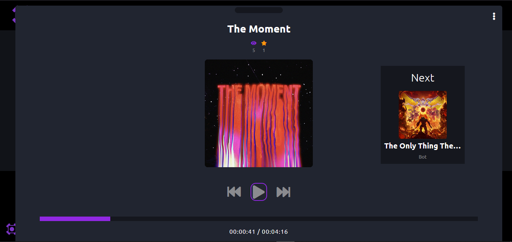

# Musicify
Musicify, a nice music app.
**A WIP app that will have it's on twists!**
---

---

---

---

## How to run
* Clone this repo
* Open 2 terminals
* `cd frontend => npm run dev`
* `cd musicifyApi => python manage.py runserver`
* **(Optional - Make changes to css)** `npm run postcss-run`

### Desc
I made this app to strengthen my knowledge of programming/web dev. in general, I learned numerous crucial things and am definitely having fun!

#### What can you do?
- Everything that a typical music app can but maybe with less features :>

##### Made and finished with <3 by IsolatedGamer at Jan. 30, 2022

